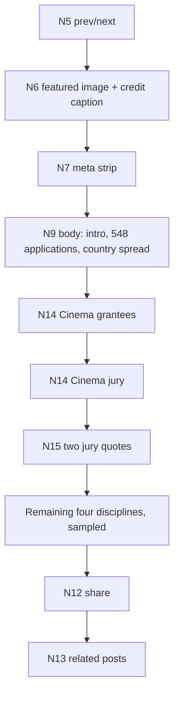

# Populate News — landing + two post details

One Task 2 unit, five phases. Adds two blocks (N14, N15) and one route. Landing/detail is the split point if the session runs long.

## Sources

- Announcement: [Results of Production Awards 2026](https://mawred.org/mawred-news/results-of-production-awards-2026/?lang=en) — saved at `/Users/Eytyy/.cursor/projects/Users-Eytyy-Code-mawred-wireframes/uploads/results-of-production-awards-2026-2.md`. Intro + 548 applications / 29 selected / country spread, then five disciplines each with ~5–6 grantees, a three-member jury and 1–2 jury quotes, then an italic image credit.
- Editorial: [Opening of Made With Your Magic Exhibition in Beirut](https://mawred.org/mawred-news/opening-of-made-with-your-magic-exhibition-in-beirut/?lang=en) — five prose paragraphs, one hard key detail (Thursday 30 July, 6:00–9:00 pm, Beirut Art Center), 22 artists, no roster.
- Landing card only: [Grantees of the Second Round of Wijhat 2026](https://mawred.org/mawred-news/grantees-of-the-second-round-of-wijhat-2026/?lang=en).

## The WordPress finding, for the record

Not a blocker, and the repo already assumed it. `references/program-component-register.md` line 9 commits the block kit to "ACF Flexible Content or Gutenberg block patterns". A roster is an ACF Repeater in a block (or InnerBlocks); a quote with attribution is `core/pullquote`, which ships with WordPress. The cost is editorial data entry, not build — mitigated by the shared-source relation the News spec's decision 2 and `specs/mawred-network.md` §B6 already flag (the roster is the same records the Network directory holds), and by the prose body staying available. This goes in `docs/content-map.md` as the reason the inserts were added rather than left as prose.

## Phase 1 — Landing config

`lib/pages/news.ts`:

- `NEWS_CATEGORIES` drops its invented `231 / 128 / 103` counts. Nothing live publishes a total, and the Announcements / News & Events taxonomy does not exist yet, so its counts cannot. `Tabs.count` is already optional after the Network unit. Extends decision 112.
- `NEWS_PROGRAMME_FACET` gains real `values`: Production Awards, Wijhat, Stand for Art, Abbara. This retires the last kit rendering `"value"`, so decision 109's closing note gets revised in place.
- New `NEWS_POSTS` — three records, `{ title, date, category, programme?, href }`, newest first: exhibition (27 July 2026, News & Events), Wijhat grantees (20 July 2026, Announcements, Wijhat), Production Awards results (6 May 2026, Announcements, Production Awards).
- `NEWS_TOTAL_PAGES = 26` stays — the pager is real, server-rendered and published.

## Phase 2 — Landing blocks

- `NewsCard` in [components/blocks/news/N3PostFeed.tsx](components/blocks/news/N3PostFeed.tsx) takes an optional `post`; given none it renders exactly today's placeholder card (decision 84).
- `N3PostFeed` takes optional `posts`, renders them, and follows with PA4's overflow line — "… 26 pages of posts in the archive" (decision 108). No per-tab number, because none is published.
- The tabs do real work: `NewsLandingPage` already owns `activeIdx`, so it filters `NEWS_POSTS` by category — All 3, Announcements 2, News & Events 1. The `filtered` state narrows to the Wijhat post on a `Programme: Wijhat ×` chip, the way MN4/MN5 narrow to a real row.
- `N2CountRow` reads "Showing N posts" with no denominator, scoped to the open tab.

## Phase 3 — Two new blocks

`components/blocks/news/N14Roster.tsx` — one block, used for both grantees and jury:

```tsx
export type RosterRecord = {
  name: string;
  country: string;
  role: string;
  project?: string;
  description?: string;
};
type N14RosterProps = {
  label: string; // "Cinema" | "Jury"
  records?: RosterRecord[]; // absent → placeholder cards (decision 84)
  overflow?: string;
};
```

Jury entries carry name, country and role only; the project fields render by omission (standing constraint 3), which is why this is one block and not two. Card grid over the existing `CardGrid`; no new utilities.

`components/blocks/news/N15Quotes.tsx` — one or more quotes, each with an attribution line. 3px border, matching N8's callout weight (decision 57).

Both are `optional` blocks, so they render dashed and the state panel governs them like N8/N10/N11.

`N6FeaturedImage` gains an optional `caption` — both roster posts end with an italic image credit and the block has nowhere to put it.

## Phase 4 — Detail routes

- `/news/post` becomes **Results of Production Awards 2026** — real title, crumb and `indexSublabel` in [lib/pages/routes.ts](lib/pages/routes.ts), keeping the `newsdetail` states key.
- New `/news/editorial-post` → **Opening of Made With Your Magic Exhibition in Beirut**, with its own states key carrying `byline` only. The structured inserts cannot occur on a prose-only editorial post, and a toggle for a state a page can't be in is what decisions 95, 103 and 114 removed elsewhere.
- New shell `app/news/editorial-post/EditorialPostPage.tsx` alongside the existing [app/news/post/NewsDetailPage.tsx](app/news/post/NewsDetailPage.tsx).

Composition of the announcement post:



**Sampling.** Cinema is populated in full — five grantees, three jurors, two quotes. Literature carries its roster with no quotes, to show the repetition and that quotes are per-discipline rather than per-post. The remaining three disciplines resolve to an overflow line naming them and the total: "… 29 grantees across five disciplines". Extends decisions 104 / 108 / 110.

The editorial post is N5 · N6 with credit · N7 · N8 (the 30 July opening, its only hard fact) · N9 five paragraphs · N12 · N13 — no roster, no quotes, no schedule, no CTA. Worth noting that N8 was specced as an announcement insert and it is the _editorial_ post that has the strongest key detail.

`NEWS_RELATED_COUNT` gives way to the three real posts, so "related" reads as related on both pages.

## Phase 5 — Docs

- `docs/content-map.md` — a News section, block by block, landing then both posts, including the WordPress reasoning above and the sampling.
- `docs/wireframe-passes.md` — decisions **115 onward**: three sampled posts with real categories driving the tabs; invented counts retired; the programme facet's real values (and decision 109's note revised in place); N14 as one block for grantees and jury; N15 as its own block; two detail routes one per post kind, each with its own states key; the sampling inside the announcement; N6's caption slot.
- `docs/tracker.md` — tick News, add a log entry.

## Verification

Type-check and lint, then curl the running dev server for `/news`, `/news/post`, `/news/editorial-post` plus `/network`, `/publications/research` and one programme page — the last three confirm the `NewsCard`, `Tabs`, `FilterBar` and `Banner` changes didn't disturb pages already signed off. Render-check the landing in default, per-tab, `filtered`, `empty` and `slots`, and both posts in every state their key offers.

## Gaps expected

No published post total and no real category taxonomy, so the count row has no denominator. Grantee rosters overlap the Network records and the programme past-beneficiaries — the shared source is flagged, not designed. The eight-target share bar stays untrimmed pending the client's copy/QA call.
