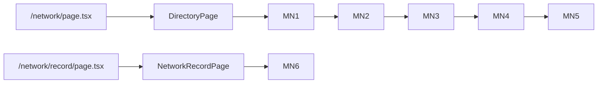

# Port Mawred Network

**Task 1, unit: Mawred Network.** Source is [references/legacy-wireframes.html](references/legacy-wireframes.html) lines 447–514 (MN1–MN6), 851–864 (network helpers), 1039–1051 (page assembly), cross-checked against [specs/mawred-network.md](specs/mawred-network.md) Part B. Structure is settled — this composes and lays out, it does not re-litigate.

Two screens, one record type: a filtered directory index (MN1–MN5) and the full record (MN6).

## 1. Shared primitives first

Per decision 62, the unit that first needs a primitive owns it for the whole app. News (N1 tabs, N3 rows) reuses all of these.

- **New** `components/wireframe/Tabs.tsx` — presentational tab row, `{ items: {label, count}[], activeIdx, onSelect }`. Legacy `.tab`: 1px border, `-mr-px`, active `border-2 font-bold`, count in `text-xs text-neutral-500`.
- **New** `components/wireframe/DirRow.tsx` — exports `DirRow` (name `text-sm font-bold` flex-1, meta spans `text-xs text-neutral-500`, `border-b border-neutral-200`) and `Badge` (1px border, `text-xs`).
- **Extend** `components/wireframe/Card.tsx` — `Cover` gains a `label` prop defaulting to `"cover"`, so MN6 can render `photo / logo` without a second cover component.
- **Extend** `components/wireframe/Figs.tsx` — a `wide` prop switching `grid-cols-2` to `grid-cols-[repeat(auto-fit,minmax(150px,1fr))]`, matching legacy `.figs.wide` for MN2's four-figure strip.

`FilterBar`, `CountRow`, `Chip`, `EmptyState`, `KV`, `Prose`, `Fill`, `Field`, `Btn` are reused as-is.

## 2. Config — `lib/pages/network.ts`

Mirrors [lib/pages/publications.ts](lib/pages/publications.ts). Holds `NETWORK_FACETS` (the five facets — Involvement 8, Programme 38, Discipline 22, Country 55, Year 22; Entity Type is deliberately absent, the tabs own it), `NETWORK_FIGURES` labels, `ENTITY_TABS` with counts (318 individuals & groups / 94 organizations & initiatives), page size 40, filtered count 12, and `DIRECTORY_HREF` / `RECORD_HREF`.

## 3. Blocks — `components/blocks/network/`

One file per block, code in the name, all content in via props.

- `MN1IntroPurpose` — fill headline + 3 prose paragraphs + the `communications@mawred.org` profile-correction row. Responsible-data commitment is permanent first-class prose here; the live "under development" notice is retired and not drawn.
- `MN2ImpactStrip` — `Figs wide` with the four facet-derived figures. Carries the impact job the dropped geo-map was doing.
- `MN3FilterBank` — name-search row (`Field` + `Btn`) above `FilterBar` with `defaultOpenIdx={1}`, so Programme opens to demonstrate the long-facet treatment (search + first six + "show all 38").
- `MN4CountRow` — `CountRow`, count scoped to the open tab, filter chips + "Clear all", sort control on the same row.
- `MN5DirectoryListing` — `Tabs`, then either `EmptyState` or eight `DirRow`s plus a centred "Load 40 more". Row = name · country · involvement badge · discipline → record detail.
- `MN6Record` — `Cover tall label="photo / logo"` left, descriptor + `KV` rows right, following the publication-detail precedent. `Round` and the project description drop out entirely in the sparse state — no empty rows, no "N/A".

## 4. Shells and routes

- `DirectoryPage.tsx` (client) — the single wireframe-state boundary per decision 60: reads `filtered` / `empty`, **and owns the `orgs` tab state**, passing it to both MN4 (count scoping) and MN5 (active tab). The tabs are navigation, not a panel toggle — matching the existing note on the `directory` states entry in [lib/pages/states.ts](lib/pages/states.ts). Filters stay applied across a tab switch.
- `NetworkRecordPage.tsx` (client) — reads `sparse` and passes it to MN6. Unlike `PublicationDetailPage` (server, no states), the `record` screen has a state, so the shell is the boundary.
- Thin routes `app/network/page.tsx` and `app/network/record/page.tsx`, matching [app/publications/research/page.tsx](app/publications/research/page.tsx).
- Drop `stub: true` from the `network` and `network-record` entries in [lib/pages/routes.ts](lib/pages/routes.ts). Titles, crumbs and `statesKey` values are already correct; `directory` and `record` state configs already exist and need no change.

Legacy page-level trailing hints (listing/record are two views of one type; one record page serves both entity types) are dropped, following the Publications precedent where `LibraryPage` and `SeriesPage` carry block hints only.

## 5. Docs, then stop

- Tick Mawred Network in [docs/tracker.md](docs/tracker.md) and add a log entry at the top of the log: what was built, that content population is Task 2, and the two flags below.
- Append to [docs/wireframe-passes.md](docs/wireframe-passes.md), continuing from 65: the tab state living in `DirectoryPage` rather than inside a `Tabs` primitive (MN4 needs the same value), `Tabs` / `DirRow` as shared primitives ahead of News, and the `Cover` label prop over a second cover component.
- Flag, not design: the shared record source between this directory and the programs' past-beneficiaries block (spec §B6, a data-architecture note), and the long Programme/Country/Year facets whose real treatment is a design-stage revisit.
- Leave the diff staged and unreviewed-uncommitted per the git rule, then stop rather than starting News.
